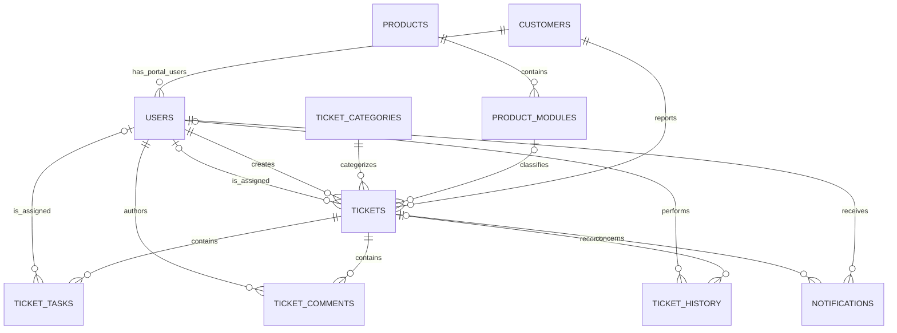

# Database design

This document describes the initial relational model for the Alias Informatique ticket-management application. The physical implementation is in [`database/schema.sql`](../database/schema.sql); optional, entirely synthetic reference data is in [`database/seed.sql`](../database/seed.sql).

The design targets Microsoft SQL Server and deliberately stays small enough to explain and maintain in a Licence 3 MIAGE project. FastAPI accesses it through SQLAlchemy; Angular never connects to SQL Server directly.

## Confirmed scope, assumptions and technical decisions

Confirmed by the project brief:

- customers create support requests represented by tickets;
- users have role-based access;
- a ticket has a category, priority, workflow status, tasks, comments and history;
- products, modules, categories and SLA values must be configurable;
- in-application notifications are sufficient for the first version;
- passwords must only be stored as secure hashes.

The company's detailed operating rules and exact catalogue are not documented.

**Assumption — to be validated with Alias Informatique.**

The following statements are working assumptions:

- the four initial roles are `ADMIN`, `MANAGER`, `AGENT` and `CLIENT`;
- one agent is the primary person responsible for a ticket; other employees can contribute through tasks and comments;
- a client portal user belongs to at most one customer organization;
- the product is obtained through the selected module (`ticket -> module -> product`); a module may temporarily be absent when the request is not yet classified;
- SLA targets are continuous elapsed hours, not business-opening hours, and depend only on priority in the MVP;
- the SLA warning threshold is the percentage of the target duration that has elapsed;
- reopening a closed ticket starts a new SLA cycle from the reopening action;
- the proposed categories, catalogue entries and the 72/48/24/8-hour targets in `seed.sql` are demonstration values only;
- physical deletion is not part of normal operation: configurable records and users/customers are deactivated to preserve history.

Technical decisions:

- integer identity primary keys are easy to use with SQLAlchemy and SQL Server;
- all timestamps use `DATETIME2(0)` and contain UTC values; conversion to local time belongs in the API/UI;
- human-readable ticket references (for example `TKT-20260816-A1B2C3D4`) are generated by the backend using the UTC date and an uppercase random hexadecimal suffix, then protected by a database uniqueness constraint;
- stable workflow values use checked `VARCHAR` columns instead of extra lookup tables;
- configurable business data uses normal tables with `is_active` flags;
- all foreign keys use SQL Server's default `NO ACTION` behavior. This prevents a customer, user or ticket from being deleted while dependent business history exists.

## Relationship overview

`sla_configurations` is intentionally not referenced by a ticket. The service selects the active rule for the ticket's priority and stores the resulting deadline in `tickets.sla_deadline`. This snapshot keeps an existing ticket's deadline stable if an administrator later edits the rule.

## Table dictionary

| Table | Purpose and important columns |
| --- | --- |
| `customers` | Customer organizations and their principal contact details. `is_active` allows safe deactivation. |
| `users` | Login identities, secure `password_hash`, constrained `role`, active flag, and optional `customer_id` for client accounts. Email is unique. |
| `products` | Administrator-managed product catalogue. Product names are unique. |
| `product_modules` | Modules belonging to one product. `(product_id, name)` is unique, so two products may use the same module name. |
| `ticket_categories` | Administrator-managed ticket categories with unique names. |
| `sla_configurations` | One configurable active-or-inactive row per priority, containing `target_hours` and `warning_threshold_percent`. Both values are range checked. |
| `tickets` | Central request record: unique reference, customer, category, optional module, priority, current status, creator, primary assignee, resolution fields, persisted SLA deadline and timestamps. Product is reached through the module. |
| `ticket_tasks` | Work units associated with a ticket, optionally assigned to a user, with status, deadline and completion timestamp. |
| `ticket_comments` | Immutable chronological discussion entries with ticket, author, content and creation time. |
| `ticket_history` | Simple chronological audit trail. `event_type` identifies the action and `details` supplies a readable explanation. A nullable actor supports automatic system events. |
| `notifications` | In-application alerts for one recipient, optionally linked to a ticket, with a constrained type and read/unread flag. |

The current state appears only in `tickets.status`; there is no duplicate `current_state` column. Likewise, product is not duplicated on `tickets`, because `product_modules.product_id` already determines it. These choices avoid inconsistent copies of the same fact.

## Controlled values

The database constraints and Python enums must change together.

| Domain | Allowed values |
| --- | --- |
| User role | `ADMIN`, `MANAGER`, `AGENT`, `CLIENT` |
| Ticket priority | `LOW`, `MEDIUM`, `HIGH`, `CRITICAL` |
| Ticket status | `NEW`, `ASSIGNED`, `IN_PROGRESS`, `WAITING`, `RESOLVED`, `VALIDATED`, `CLOSED`, `REOPENED` |
| Task status | `TODO`, `IN_PROGRESS`, `BLOCKED`, `DONE`, `CANCELLED` |
| Notification type | `ASSIGNMENT`, `SLA_WARNING`, `SLA_OVERDUE`, `TASK_WARNING`, `TASK_OVERDUE`, `UPDATE` |

Roles are kept as an enum because the MVP has four well-understood permission profiles implemented in FastAPI. A roles/permissions matrix in the database would add administration and authorization complexity without a confirmed need. Categories are tables because administrators are explicitly expected to configure them.

Workflow transition rules are business logic, not just data validation. FastAPI must enforce the permitted ticket transitions, require resolution information before `RESOLVED`, restrict validation/closure to authorized roles, and record every transition in `ticket_history`. Database checks protect valid codes and referential integrity but intentionally do not duplicate the whole workflow engine.

## SLA handling

For a new ticket, when its priority changes, or when a closed ticket is reopened, the backend performs these steps in one transaction:

1. load the active `sla_configurations` row for the priority;
2. calculate `sla_deadline = cycle-start UTC time + target_hours`;
3. store the deadline on the ticket;
4. append a history event describing the calculation or change.

The reopening event's `ticket_history.created_at` is the start of the new cycle; a duplicate `reopened_at` field is unnecessary. The history details should retain the former and replacement SLA deadlines so the change remains understandable.

An alert job can compare the current UTC time with the ticket deadline. A warning is due when elapsed time reaches `warning_threshold_percent`; a ticket is overdue when the deadline has passed and its current status is not resolved, validated or closed. Notifications remain in-application only.

**Assumption — to be validated with Alias Informatique:** changing an SLA configuration does not silently recalculate existing tickets. If the company wants retroactive recalculation, it should be an explicit manager action that also writes a history event. Paused clocks, working calendars, holidays and customer/product-specific rules are outside this MVP.

## Integrity and application-level rules

The database enforces:

- primary keys, unique user email/ticket reference/catalogue names and all foreign keys;
- valid role, priority, status and notification codes;
- positive SLA durations and thresholds from 1 to 100 percent;
- non-blank mandatory names/content;
- basic timestamp chronology.

Some rules depend on multiple records or user identity and therefore belong in FastAPI services:

- normalize emails to lowercase before storing or comparing them;
- require `customer_id` for `CLIENT` users and normally forbid it for internal users;
- ensure a client can only create/view tickets for their own customer;
- assign tickets and tasks only to active internal users;
- use only active customers, categories, modules and SLA configurations for new records;
- update `updated_at` on every modification;
- create history entries in the same transaction as the action they describe;
- ensure `DONE` tasks have `completed_at`, and resolved/validated/closed tickets receive the corresponding timestamps;
- clear or deliberately preserve completion fields according to the validated reopening rule;
- avoid duplicate warning/overdue notifications in the periodic alert service.

SQLAlchemy parameter binding and request validation are required; API code must never build SQL by concatenating user input.

## Index strategy

SQL Server does not automatically index foreign keys. The schema adds a small set of indexes that match expected screens and jobs:

- customer-name search and active users by role;
- modules by product;
- tickets by status/priority, customer/date, assignee/status and status/SLA deadline;
- tasks by ticket/status and assignee/status/deadline;
- chronological ticket comments and history;
- unread/read notifications for a recipient.

The unique constraints also create indexes for email, catalogue names and ticket references. More indexes should only be added after observing actual slow queries because every index adds write and storage cost.

## Seed and administrator bootstrap

Run the scripts in this order from SQL Server Management Studio or another tool that understands `GO` batch separators:

1. select a newly created application database;
2. execute `database/schema.sql`;
3. optionally execute `database/seed.sql` for development data.

The seed is idempotent: it inserts missing rows by their natural unique names/priorities and does not overwrite administrator changes. It contains only proposed categories/products/modules/SLA values and two visibly fictional customers using the reserved `example.com` domain.

No user or password is present in SQL. Create the first administrator through the backend bootstrap configuration:

1. set `BOOTSTRAP_ADMIN_EMAIL` and a strong, temporary `BOOTSTRAP_ADMIN_PASSWORD` in the local `.env` file;
2. start the FastAPI application so its bootstrap routine hashes the password with the configured secure password hasher before inserting it;
3. log in, change/rotate the password if the application supports it, then remove `BOOTSTRAP_ADMIN_PASSWORD` from the environment;
4. never commit `.env`, a password, or a generated password hash intended for a shared account.

This route is preferable to embedding even a precomputed demonstration hash in source control, because a published hash still enables a shared known credential. The SQL script's `password_hash` field is only a storage destination; hashing and password policy remain backend responsibilities.

## Deliberate MVP limitations

- There is no attachment table or binary/file storage yet. Attachments require a validated storage and access-control policy.
- There are no private/internal comment flags; every comment follows ticket visibility rules.
- A ticket has one primary assignee instead of a many-to-many assignment team.
- SLA rules do not yet vary by customer, category, product or module and do not use business calendars.
- History is ticket-focused, not a general forensic audit of every table.
- In-application notifications are implemented; email delivery is a future improvement.
- Reporting KPIs are calculated from normalized transactional data rather than stored aggregates.

These limitations keep the first version coherent and defendable. They can be extended after the corresponding business rules are confirmed.
